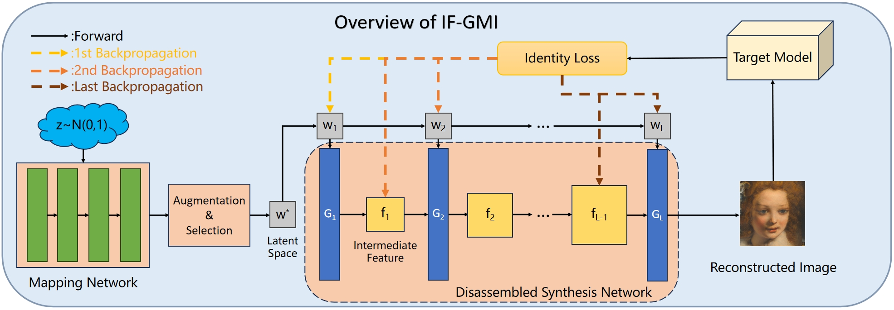
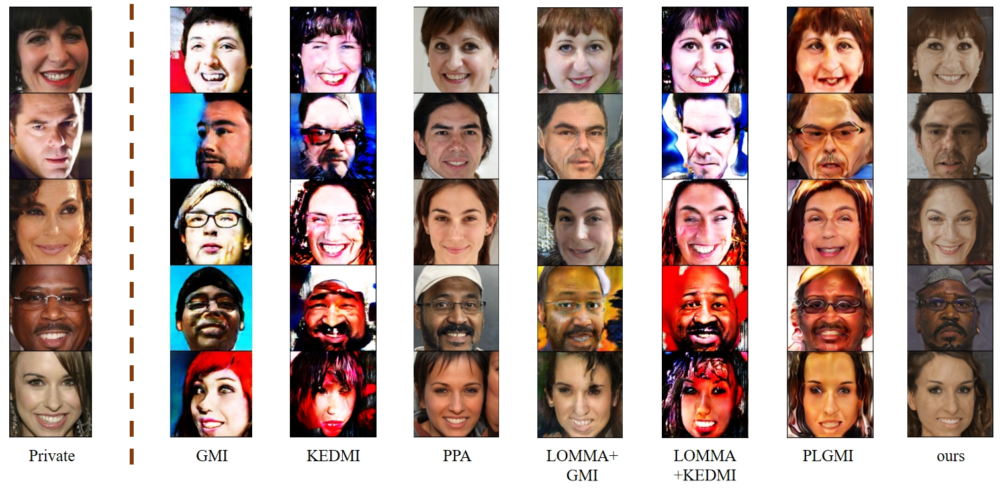

# A Closer Look at GAN Priors: Exploiting Intermediate Features for Enhanced Model Inversion Attacks

[Yixiang Qiu*](https://scholar.google.cz/citations?hl=zh-CN&user=kxotrxgAAAAJ),
[Hao Fang*](https://scholar.google.cz/citations?user=12237G0AAAAJ&hl=zh-CN),
[Hongyao Yu*](https://scholar.google.cz/citations?user=SpN1xqsAAAAJ&hl=zh-CN),
[Bin Chen#](https://github.com/BinChen2021),
[Meikang Qiu](https://scholar.google.cz/citations?hl=zh-CN&user=smMVdtwAAAAJ),
[Shu-Tao Xia](https://www.sigs.tsinghua.edu.cn/xst/main.htm)

[ECCV-2024 Oral] A PyTorch official implementation for [A Closer Look at GAN Priors: Exploiting Intermediate Features for Enhanced Model Inversion Attacks](https://arxiv.org/abs/2407.13863), accepted to ECCV-2024.

## Visual Results

